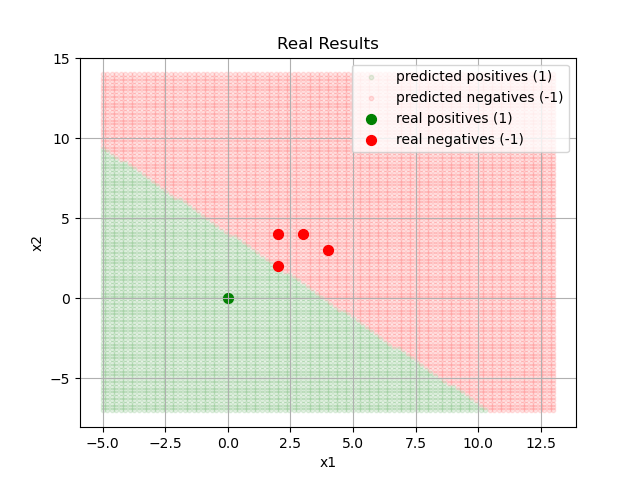

# Mortrack_ML_Library  
  
## What is Mortrack_ML_Library?  
This is a library whose creation was started from scratch by the engineer Cesar Miranda Meza (alias Mortrack) on May 1, 2020 for personal use at first and without any scientific formality. Without any assistance and intuitively using well known mathematical tools, the author completed this library on May 26, 2020. It was then first publicly released on May 10, 2021 so that it can help others as it helped the author in many of his professional works and research. In this sense, the Mortrack_ML_Library proposes a complete and different approach to working with machine learning algorithms with respect to other librarys. It has the outstanding features and philosophy of having lightweight code, having transparent output trained models and providing its applicability on on a different computer from where it is being applied even without the use of this library. Furthermore, this library has been engineering in the Python programming languange and to have a similar framework as the current most popular machine learning librarys in order to provide a user friendly and intuitive programming interface.  
  
Latest public stable version: 1.0.0.1 (released on May 10, 2021 in master branch)  
  
## What machine learning tools does this Library provide?  
1. Functions for statistics:  
    - **getMean():** Function to calculate the mean in 1 or more lists contained within an array.  
    - **getVariance():** Function to calculate the variance in 1 or more lists contained within an array.  
    - **getStandardDeviation():** Function to calculate the standard deviation in 1 or more lists contained within an array.  
   - Functions to compute confidence intervals in 1 or more lists contained within a matrix.  
        - **getCriticalValue():** Function to calculate the critical value for confidence intervals of 95%, 99% or 99.9% in 1 or more lists contained within a matrix.  
        - **getMeanIntervals():** Function to calculate the average confidence intervals on 1 or more lists contained within a matrix.  
        - **getPredictionIntervals():** Function to compute prediction intervals on 1 or more lists contained within a matrix.  
2. Functions for database processing:  
    - **getDatasetSplitted():** Function to apply data splitting in a database in a customized way (includes random data splitting option).  
3. Functions to apply data scaling:  
    - **getStandarization():** Function to return a dataset with the standardization method applied to it, together with the mean and standard deviation calculated for the application of the method.  
    - **getReverseStandarization():** Function to return a dataset with the inverse application of the standardization method under a value of the mean and standard deviation to be specified when calling this function.  
4. Functions for machine learning (all these methods include a function for training and one for making predictions):  
   - Functions for regression methods:  
        - **getLinearLogisticRegression()** and **predictLinearLogisticRegression():** Linear logistic regression without hyperparameters (gives continuous values, so if a threshold is applied, then this function could be used for classification instead of a regression method).  
        - **getLinearRegression()** and **predictLinearRegression():** Linear regression without hyperparameters.  
        - **getMultipleLinearRegression()** and **predictMultipleLinearRegression():** Multiple linear regression without hyperparameters.  
        - **getPolynomialRegression()** and **predictPolynomialRegression():** Polynomial regression without hyperparameters.  
        - **getMultiplePolynomialRegression()** and **predictMultiplePolynomialRegression():** Multiple polynomial regression without hyperparameters.  
        - **getCustomizedMultipleSecondOrderPolynomialRegression()** and **predictCustomizedMultipleSecondOrderPolynomialRegression():** Customized multiple second order polynomial regression ().
        - **getCustomizedMultipleThirdOrderPolynomialRegression()** and **predictCustomizedMultipleThirdOrderPolynomialRegression():** Customized multiple third order polynomial regression ().  
   - Functions for classification methods:  
        - **getSupportVectorMachine()** and **predictSupportVectorMachine():** Support vector machine classification without hyperparameters.  
        - **getKernelSupportVectorMachine()** and **predictKernelSupportVectorMachine():** Kernel support vector machine classification without hyperparameters.  
        - **getLinearLogisticRegression()** and **predictLinearLogisticClassifier():** Classification with linear logistic regression without hyperparameters.  
   - Functions for reinforcement learning methods (the following do not have a predict method due to their nature):  
        - **getUpperConfidenceBound():** Upper confidence bound with the capacity to learn from an entire complete history.  
        - **getRealTimeUpperConfidenceBound():** Upper confidence bound with the capacity to learn from real-time data.  
        - **getModifiedUpperConfidenceBound():** Modified upper confidence bound with the capacity to learn from an entire complete history (prediction intervals are used within the logic of the algorithm).  
        - **getRealTimeModifiedUpperConfidenceBound():** Modified upper confidence bound with the capacity to learn from real-time data (prediction intervals are used within the logic of the algorithm).  
   - Functions for deep learning methods:  
        - **getSingleArtificialNeuron()** and **predictSingleArtificialNeuron():** Single artificial neuron
        - **getArtificialNeuralNetwork()** and **predictArtificialNeuralNetwork():** Artificial neural network
        
			NOTE: The available transformation functions for the deep learning methods are: 'sigmoid', 'relu', 'tanh', 'raiseTo2ndPower', 'raiseTo3rdPower', 'raiseTo4thPower', 'raiseTo5thPower', 'raiseTo6thPower', 'exponential'.
  
## How to use this Library?  
1. Download it either manually or through git in a terminal window on your computer ($ git clone https://github.com/Mortrack/Mortrack_ML_Library.git) and it is highly recommended to use latest version from the master branch to get the latest stable version.   
2. Open the file named "main.py" located in the root directory of the downloaded files. It is recommended as a good practice to program and use this Library through that file and follow the proposed machine learning programming framework, which is described with comments in such file.  
3. Once you have identified that this Library contains the machine learning algorithm you wish to use, inspect the file named "MortrackML_Library.py" located in "/MortrackLibrary/machineLearning/".  
4. In that file, search for the class method that has the name of the algorithm you want to use, which will provide a description of how to use (advice: click the CTRL+F buttons to use the Find tool). This will appear as a commented section just before the code of that method and there you you will also have at your disposal an example code.  
5. Copy the code example as a reference and paste it in the "main.py" file (identified in step 2) to then edit it as your application requires.
  
NOTE: As a bonus, this Library also has some linear algebra mathematical tools that you can find in the file named "MortrackLinearAlgebraLibrary.py", which is located in "/MortrackLibrary/linearAlgebra/". The documentation on how to use them is also in commented sections within the file, just as explained for the machine learning library file (MortrackML_Library.py) in step 4.  
  
### Simple and compact code example  
  
Code written into "main.py" file from the Mortrack ML Library:  
  
```python  
# ------------------------------- #  
# ----- IMPORT OF LIBRARIES ----- #  
# ------------------------------- #  
# "mSL" is the library that provides all the algorithms and tools of machine  
# learning.  
from MortrackLibrary.machineLearning import MortrackML_Library as mSL  
  
  
# ----------------------------- #  
# ----- IMPORT OF DATASET ----- #  
# ----------------------------- #  
# The dataset is imported/loaded.  
matrix_x = [  [0, 0], [2, 2], [4, 3], [2, 4], [3, 4], [4, 4], [5, 3], [3, 5], [4, 6], [1, 0], [2, 1], [1, 3], [2, 1], [7, 4], [4, 7], [7, 3], [7, 5], [4, 7] ]
matrix_y = [  [1], [1], [1], [1], [-1], [-1], [-1], [-1], [-1], [1], [1], [1], [1], [-1], [-1], [-1], [-1], [-1] ]  
  
# ------------------------- #  
# ----- DATA MODELING ----- #  
# ------------------------- #  
# We use the Linear Support Vector Machine algorithm for the traning process.  
classification = mSL.Classification(matrix_x, matrix_y)  
modelingResults = classification.getSupportVectorMachine()  
modelCoefficients = modelingResults[0]  
acurracyFromTraning = modelingResults[1]  
predictedData = modelingResults[2]  
coefficientDistribution = modelingResults[3]  
allModeledAccuracies = modelingResults[4]  
  
  
# ------------------------------------ #  
# ----- PREDICTIONS OF THE MODEL ----- #  
# ------------------------------------ #  
# We obtain the predicted values and save them in "predictedData".  
classification.set_xSamplesList(matrix_x)  
predictedData = classification.predictSupportVectorMachine(coefficients=modelCoefficients)  
```  
  
Expected code result:  
  
```$python  
modelCoefficients = [  
 [1.4286720489864382], [-0.2425903533521429], [-0.22947736127905405] ]  
acurracyFromTraining =  
94.44444444444444  
  
predictedData = [  
 [1], [1], [-1], [1], [-1], [-1], [-1], [-1], [-1], [1], [1], [1], [1], [-1], [-1], [-1], [-1], [-1] ]
```  

### Complete and ideal code example (applying all machine learning best practices)  
  
Code written into "main.py" file from the Mortrack ML Library:  
  
```python  
# ------------------------------- #  
# ----- IMPORT OF LIBRARIES ----- #  
# ------------------------------- #  
# "mSL" is the library that provides all the algorithms and tools of machine  
# learning.  
from MortrackLibrary.machineLearning import MortrackML_Library as mSL  
# The following libraries are imported to be used for the graphical  
# visualizaiton of the results obtained.  
import matplotlib.pyplot as plt  
import numpy as np  
  
  
# ----------------------------- #  
# ----- IMPORT OF DATASET ----- #  
# ----------------------------- #  
# The dataset is imported/loaded.  
matrix_x = [  [0, 0], [2, 2], [4, 3], [2, 4], [3, 4], [4, 4], [5, 3], [3, 5], [4, 6], [1, 0], [2, 1], [1, 3], [2, 1], [7, 4], [4, 7], [7, 3], [7, 5], [4, 7] ]
y = [  [1], [1], [1], [1], [0], [0], [0], [0], [0], [1], [1], [1], [1], [0], [0], [0], [0], [0] ]  
  
# ------------------------------------- #  
# ----- PREPROCESSING OF THE DATA ----- #  
# ------------------------------------- #  
# We make sure to convert the binary data from the dataset into "+1" for the  
# high states (1) and into "-1" for the low states (0) due to that the machine  
# learning algorithm to be used requires the input data to be in this format.  
matrix_y = []  
for currentRow in range(0, len(y)):  
    temporalRow = []
    for currentColumn in range(0, len(y[0])):
        if (y[currentRow][currentColumn] == 1):
            temporalRow.append(1)
        elif (y[currentRow][currentColumn] == 0):
            temporalRow.append(-1)
        else:
            raise Exception('ERROR: The dataset has values that are non-binary!.')
    matrix_y.append(temporalRow)
        
# -------------------------- #  
# ----- DATA SPLITTING ----- #  
# -------------------------- #  
# We randomly split the data into training (70%) and test set (30%).  
dS = mSL.DatasetSplitting(matrix_x, matrix_y)  
datasetSplitResults = dS.getDatasetSplitted(testSize = 0.30, isSplittingRandom = False)  
x_train = datasetSplitResults[0]  
x_test = datasetSplitResults[1]  
y_train = datasetSplitResults[2]  
y_test = datasetSplitResults[3]  
  
# --------------------------- #  
# ----- FEATURE SCALING ----- #  
# --------------------------- #  
# We normalize the training set and we save the obtained parameters (the mean  
# and standard deviation).  
featureScaling = mSL.FeatureScaling(x_train)  
normalizedResults_xTrain = featureScaling.getStandarization()  
preferedMean_xTrain = normalizedResults_xTrain[0]  
preferedStandardDeviation_xTrain = normalizedResults_xTrain[1]  
normalizedDataPoints_xTrain = normalizedResults_xTrain[2]  
  
# We normalize the test set by using the parameters obtained in the  
# normalization process of the training set (the mean and standard deviation).  
featureScaling = mSL.FeatureScaling(x_test)  
normalizedResults = featureScaling.getStandarization(preferedMean=preferedMean_xTrain, preferedStandardDeviation=preferedStandardDeviation_xTrain, isPreferedDataUsed = True)  
normalizedDataPoints_xTest = normalizedResults[2]  
  
# ------------------------- #  
# ----- DATA MODELING ----- #  
# ------------------------- #  
# We use the Linear Support Vector Machine algorithm to train it with the  
# training set.  
classification = mSL.Classification(normalizedDataPoints_xTrain, matrix_y)  
# evtfbmip stands for "Eliminate Variables To Find Better Model If Possible"  
modelingResults = classification.getSupportVectorMachine(evtfbmip = True)  
modelCoefficients = modelingResults[0]  
acurracyFromTraning = modelingResults[1]  
predictedData = modelingResults[2]  
coefficientDistribution = modelingResults[3]  
allModeledAccuracies = modelingResults[4]  
  
  
# ------------------------------------ #  
# ----- PREDICTIONS OF THE MODEL ----- #  
# ------------------------------------ #  
# We obtain the prediction values corresponding to the test set.  
classification.set_xSamplesList(normalizedDataPoints_xTest)  
predictedValues_xTest = classification.predictSupportVectorMachine(coefficients=modelCoefficients)  
  
  
# ------------------------------------------------------------ #  
# ----- GRAPHICAL VISUALIZATION OF THE PREDICTED RESULTS ----- #  
# ------------------------------------------------------------ #  
# ----- We plot the Background ----- #  
# We obtain the matrix that will contain the data to plot the background of the  
# graph  
plt.figure()  
x1_samples = []  
x2_samples = []  
for row in range(0, len(matrix_x)):  
    x1_samples.append(matrix_x[row][0])
    x2_samples.append(matrix_x[row][1])
x1_distance = min(x1_samples) - max(x1_samples)  
x2_distance = min(x2_samples) - max(x2_samples)  
x1_background = np.linspace(min(x1_samples)+x1_distance, max(x1_samples)-x1_distance, num=100)  
x2_background = np.linspace(min(x2_samples)+x2_distance, max(x2_samples)-x2_distance, num=100)  
predictThisValues = []  
for row in range(0, len(x1_background)):  
    for row2 in range(0, len(x2_background)):
        temporalRow = []
        temporalRow.append(x1_background[row])
        temporalRow.append(x2_background[row2])
        predictThisValues.append(temporalRow)
# We normalize the background-matrix by using the parameters obtained in the  
# normalization process of the training set (the mean and standard deviation).  
featureScaling = mSL.FeatureScaling(predictThisValues)  
normalizedResults = featureScaling.getStandarization(preferedMean=preferedMean_xTrain, preferedStandardDeviation=preferedStandardDeviation_xTrain, isPreferedDataUsed = True)  
normalizedDataPoints_predictThisValues = normalizedResults[2]  
# We obtain the prediction values corresponding to the backgroun-matrix data  
classification.set_xSamplesList(normalizedDataPoints_predictThisValues)  
predictedValuesForBg = classification.predictSupportVectorMachine(coefficients=modelCoefficients)  
# We create four matrixes: two of them will be used to save the coordinates of  
# the positive predicted values of the trained model and the other two for the  
# coordinates of the negative predicted values.
positives_x = []  
positives_y = []  
negatives_x = []  
negatives_y = []  
for row in range(0, len(predictedValuesForBg)):  
    temporalRow = []
    if (predictedValuesForBg[row][0] == 1):
        temporalRow = []
        temporalRow.append(predictThisValues[row][1])
        positives_y.append(temporalRow)
        temporalRow = []
        temporalRow.append(predictThisValues[row][0])
        positives_x.append(temporalRow)
    else:
        temporalRow = []
        temporalRow.append(predictThisValues[row][1])
        negatives_y.append(temporalRow)
        temporalRow = []
        temporalRow.append(predictThisValues[row][0])
        negatives_x.append(temporalRow)
# We plot the background-matrix but with respect to the original input values  
# and not with the normalized values.  
plt.scatter(positives_x, positives_y, c='green', s=10, label='predicted positives (1)', alpha = 0.1)  
plt.scatter(negatives_x, negatives_y, c='red', s=10, label='predicted negatives (-1)', alpha = 0.1)  
  
  
# ----- We plot the predcited values by the model ----- #  
# We plot the predicted values of our currently trained model but with respect  
# to the original form of the input data (not on its normalized format).  
positives_x = []  
positives_y = []  
negatives_x = []  
negatives_y = []  
for row in range(0, len(predictedValues_xTest)):  
    temporalRow = []
    if (predictedValues_xTest[row][0] == 1):
        temporalRow = []
        temporalRow.append(x_test[row][1])
        positives_y.append(temporalRow)
        temporalRow = []
        temporalRow.append(x_test[row][0])
        positives_x.append(temporalRow)
    else:
        temporalRow = []
        temporalRow.append(x_test[row][1])
        negatives_y.append(temporalRow)
        temporalRow = []
        temporalRow.append(x_test[row][0])
        negatives_x.append(temporalRow)
plt.scatter(positives_x, positives_y, c='green', s=50, label='real positives (1)')  
plt.scatter(negatives_x, negatives_y, c='red', s=50, label='real negatives (-1)')  
# Finnally, we define the desired title, the labels and the legend for the data  
# points  
plt.title('Real Results')  
plt.xlabel('x1')  
plt.ylabel('x2')  
plt.legend()  
plt.grid()  
# We show the graph with all the specifications we just declared.  
plt.show() 
```  
  
Expected code result:  
  
  
  
## Permissions, conditions and limitations to use this Library  
In accordance to the Apache License 2.0 which this Library has, it can used for commercial purposes, you can distribute it, modify it and/or use it privately as long as a copy of its license is included. It is also requested to give credit to the author and to be aware that this license includes a limitation of liability and explicitly states that it does NOT provide any warranty.
